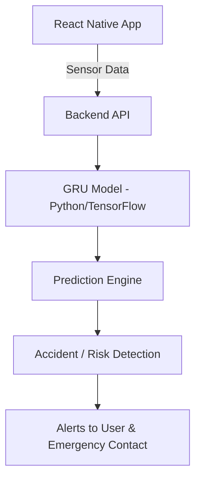

<h1 align="center">🚨 DurghatnaSoochak - दुर्घटनासूचक 🚨</h1>

<p align="center">
  <em>"DurghatnaSoochak" (Accident Indicator) is an intelligent, AI-powered system that detects accidents in real-time using smartphone sensor data and identifies accident-prone areas using historical patterns — designed to enhance road safety.</em>
</p>

<p align="center">
  ⚙️ GRU-Based Deep Learning Model • 📱 React Native Frontend • 🌐 Cross-Platform • 🧠 AI-Driven Safety Alerts
</p>

---

## 🔍 Overview

**दुर्घटनासूचक (DurghatnaSoochak)** leverages a deep learning model (GRU - Gated Recurrent Unit) and smartphone sensors (GPS, gyroscope, accelerometer) to detect accidents in real-time. It also assesses whether a user's location falls within a historically accident-prone zone.

---

## 🚀 Features

- 🧠 **Accident Detection**  
  Detects potential accidents using trained GRU deep learning models.

- 📍 **Accident-Prone Area Detection**  
  Analyzes geolocation data to determine if a location is high-risk.

- 📡 **Real-Time Sensor Monitoring**  
  Continuously gathers and processes data from smartphone sensors.

- 📲 **Cross-Platform React Native App**  
  Built using React Native and Expo for Android & iOS support.

- 📢 **Instant Alert Mechanism**  
  Triggers alerts to the user (and optionally to emergency contacts).

---

## 🛠️ Technology Stack

| Layer       | Tools / Frameworks                     |
|-------------|----------------------------------------|
| **Backend** | Python, TensorFlow/Keras, Flask / FastAPI |
| **Frontend**| React Native, Expo, JavaScript         |
| **Model**   | GRU (Gated Recurrent Unit - RNN)       |
| **Sensors** | GPS, Accelerometer, Gyroscope, etc.    |

---

## 🧠 System Architecture



---

## 🧩 How It Works
- 📱 **Data Collection**

App collects GPS, speed, acceleration, and motion data continuously.

- 🧠 **Model Analysis**

GRU model trained on labeled accident data identifies potential crash patterns.

- 📢 **Alert Mechanism**

Upon detecting an anomaly, alerts are triggered for the user and optionally shared with emergency contacts.

- 🗺️ **Zone Risk Assessment**

The system evaluates geolocation to identify entry into a historically accident-prone zone.

---

## 📁 Folder Structure

```Bash
DurghatnaSoochak/
├── backend/
│   ├── models/               # GRU model and training scripts
│   ├── data/                 # Sample datasets
│   ├── app.py                # Flask/FastAPI server
│   └── requirements.txt      # Python dependencies
├── frontend/
│   ├── src/                  # React Native source code
│   ├── App.js                # App entry point
│   ├── package.json          # Node.js dependencies
│   └── assets/               # Icons and media
└── README.md                 # Project documentation
```

---

## ⚙️ Setup Instructions

- 🧠 **Backend (Python + GRU Model)**

```bash
# Clone repo
git clone https://github.com/Omii1908/DurghatnaSoochak.git
cd DurghatnaSoochak/backend

# Create virtual environment
python -m venv venv
source venv/bin/activate  # On Windows: venv\Scripts\activate

# Install dependencies
pip install -r requirements.txt

# Run backend server
python app.py
```
You can also train the GRU model yourself or use the pretrained model provided.

- 📲 **Frontend (React Native + Expo)**

```bash
cd ../frontend

# Install dependencies
npm install

# Start the app
npm start
```
Test using Android/iOS emulator or the Expo Go app on your mobile device.

---

## 📉 Future Enhancements
- 🔗 SMS/Call notifications to emergency contacts
- 📊 Cloud-based accident analytics dashboard
- 📁 Integration with government traffic APIs
- 🔐 User login with profile-based risk prediction
- 🗂️ Sync crash history and GPS data to a secure server

---

## 🌐 Dataset Sources
- 📊 Accident Prone Zone Training: MoRTH 2022 & 2023 data
- 📱 Sensor Training Data: Simulated + real-world accelerometer/GPS data
- 🧪 GRU model trained with labeled accident and non-accident events

---

## 👨‍💻 Contributions
- Want to help improve this project? Open issues, suggest features, or fork and submit PRs.

- All contributions are welcome, especially in:
  - Model training improvement
  -  UI enhancement
  -  Backend optimization

## 🙏 Acknowledgments
- MoRTH for public accident datasets
- TensorFlow, React Native, and Expo for development tools
- Open-source communities for libraries and inspiration

---

<p align="center"> <strong>“स्वस्थं यातायातं, सुरक्षितं जीवनम्”</strong><br> <em>“Safe Traffic, Secure Life” – Let AI Drive Road Safety.</em> </p>
